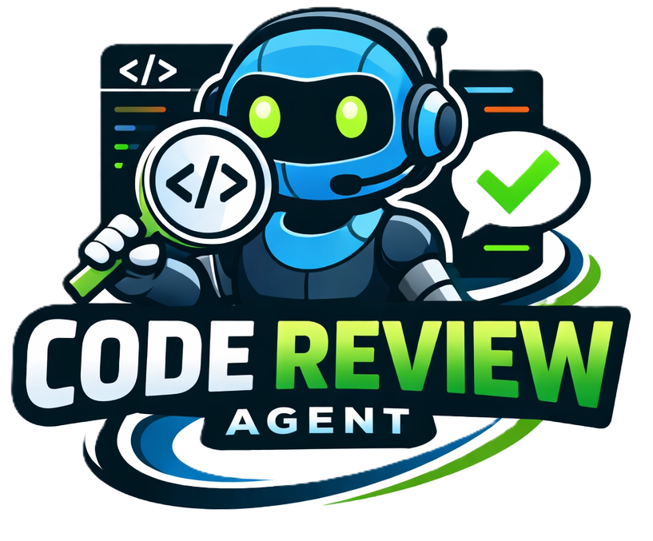

<!-- Project logo -->
<p align="center">
  
</p>

# Code Review Agent (FastAPI)

A production-quality, modular AI-powered code review service that combines:
- **Static analysis** (flake8 + bandit, with a small built-in fallback)
- **Context compression** for shorter / cheaper prompts
- **LLM-backed review** (OpenAI-compatible Chat Completions)
- **Optional prompt compression via ScaleDown** (compression only; not an LLM)
- **Optional Streamlit UI** for interactive reviews

---

## What you get

- FastAPI backend with endpoints:
  - `POST /review` (JSON)
  - `POST /review/file` (multipart upload)
  - `GET /healthz` (liveness)
  - `GET /configz` (sanitized config)
- Structured response with:
  - `compressed_context`
  - `static_analysis` (flake8 + bandit outputs)
  - `issues` (ranked, structured findings)
  - optional `strict_findings` (human-readable fixed format)

---

## Quick start (Windows / cmd.exe)

### 1) Create a virtualenv + install dependencies

```cmd
python -m venv .venv
.venv\Scripts\activate
pip install -r requirements.txt
```

### 2) Configure the LLM

This backend requires an OpenAI-compatible Chat Completions endpoint.

Set these environment variables (or create a `.env` file in the repo root):
- `LLM_API_KEY`
- `LLM_BASE_URL` (example: `https://api.openai.com/v1`)
- `LLM_MODEL` (example: `gpt-4o-mini`)

### 3) Run the API

```cmd
uvicorn app.main:app --reload
```

Open:
- API health: `http://127.0.0.1:8000/healthz`
- Swagger UI: `http://127.0.0.1:8000/docs`

---

## Run the UI (Streamlit)

The repo includes a Streamlit frontend in `ui.py`.

### Option A: Start everything with the provided script

```cmd
start_app.bat
```

This opens two windows:
- Backend (FastAPI) on `http://127.0.0.1:8000`
- Frontend (Streamlit) on `http://localhost:8501`

### Option B: Start UI manually

If you already started the backend:

```cmd
streamlit run ui.py
```

If your API isn’t at `http://127.0.0.1:8000`, set:
- `CODE_REVIEW_API_URL` (used by the UI)

---

## Configuration

Configuration is loaded from environment variables and supports a local `.env` file
(see `app/settings.py`).

### Required (for real LLM calls)

- `LLM_API_KEY` — API key for the OpenAI-compatible provider
- `LLM_BASE_URL` — base URL that serves `POST /chat/completions`
  - Example: `https://api.openai.com/v1`
  - Note: if you pass `https://api.openai.com`, the client normalizes it to `.../v1`
- `LLM_MODEL` — model name supported by your provider

### Optional

- `LLM_PROVIDER` — defaults to `openai`
  - Set `LLM_PROVIDER=none` to **disable LLM calls** (offline mode)
- `LLM_TIMEOUT_SECONDS` — request timeout (default: 30)
- `SCALEDOWN_API_KEY` — enables ScaleDown prompt compression (optional)

### Offline mode (no network / no LLM)

If you want to use only compression + static analysis:
- Set `LLM_PROVIDER=none`

The API will return an empty `issues` list. Static analysis still runs.

---

## API

### `POST /review` (JSON)

Request body:

```json
{
  "code": "def add(a, b):\n    return a + b\n",
  "language": "python",
  "filename": "example.py",
  "strict": false
}
```

Notes:
- Only `python` is supported end-to-end right now.
- If `strict=true`, the response also includes `strict_findings`.

### `POST /review/file` (multipart)

Upload a UTF-8 Python file using `multipart/form-data` with the field name `file`.

### Response shape

High-level response fields:
- `compressed_context` — compressed code summary
- `static_analysis` — tool outputs:
  - `static_analysis.flake8.issues[]`
  - `static_analysis.bandit.result.results[]`
- `issues[]` — structured items:
  - `severity`: `high | medium | low`
  - `category`: `security | bug | performance | style`
  - `description`, `suggestion`
  - optional `location`

### Health + config

- `GET /healthz` returns `{ ok, service, version }`
- `GET /configz` returns sanitized config (never returns the API key value)

---

## How it works (high level)

The backend’s review pipeline (see `app/ai_agent.py`):
1. **Compress code** (`app/compressor.py`)
2. **Run static analysis** (`app/static_checks.py`)
3. **Build a review prompt** that includes compressed context + static results
4. Optionally **compress the prompt** via ScaleDown (`app/scaledown_compression.py`)
5. Call the **real LLM** (`app/llm_client.py`) and parse/validate structured JSON
6. **Rank issues** (`app/ranker.py`) and return the response

---

## Tests

Run all tests:

```cmd
pytest
```

There’s also an interactive menu script:

```cmd
run_tests.bat
```

---

## Troubleshooting

### 400: “LLM is not configured (missing: …)”

Set `LLM_API_KEY`, `LLM_BASE_URL`, and `LLM_MODEL`, then restart the API.

If you intended to run without an LLM, set:
- `LLM_PROVIDER=none`

### 401 / 404 / 400 from the provider

The LLM client is built for OpenAI-compatible Chat Completions endpoints.
Common causes:
- `LLM_BASE_URL` missing `/v1`
- wrong `LLM_MODEL`
- key copied with quotes or redacted characters

### flake8/bandit not producing output

`flake8` and `bandit` are invoked via `python -m ...`. If the tools fail,
responses include `tool_error` / `stderr` to help diagnose environment issues.

---

## Project structure

- `app/main.py` — FastAPI app and endpoints
- `app/ai_agent.py` — orchestrates compression + static checks + LLM review
- `app/llm_client.py` — OpenAI-compatible client + safe JSON parsing
- `app/static_checks.py` — flake8 + bandit runner with small builtin fallback
- `app/compressor.py` — Python code compression
- `app/scaledown_compression.py` — optional ScaleDown prompt compression
- `ui.py` — Streamlit frontend
- `tests/` — pytest suite

---

## Security notes

- Never commit real API keys.
- Prefer using a local `.env` file for development.
- The `/configz` endpoint intentionally never returns your key.

